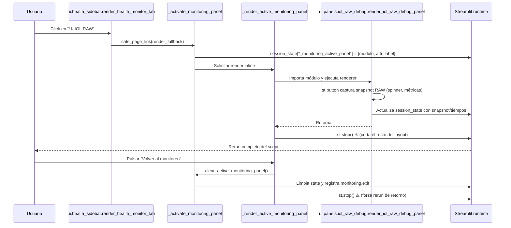

# Secuencia al abrir 🔍 IOL RAW

* `render_health_monitor_tab` detecta la selección activa y delega en `_render_active_monitoring_panel`, que importa el renderer, pinta encabezado y ofrece el botón de regreso.【F:ui/health_sidebar.py†L2088-L2164】
* `_activate_monitoring_panel` persiste la selección en `st.session_state` y emite telemetría `monitoring.enter`, de modo que el rerun siguiente conoce qué panel rehidratar.【F:ui/health_sidebar.py†L1989-L2015】
* `render_iol_raw_debug_panel` captura el snapshot RAW cuando se pulsa el botón, guarda métricas de fetch/parse y renderiza tabla + JSON paginado.【F:ui/panels/iol_raw_debug.py†L190-L266】
* Al finalizar, `_render_active_monitoring_panel` llama a `st.stop()` (⚠️) para evitar que el cuerpo principal siga renderizando; esto provoca pantallas en blanco hasta que el siguiente rerun reconstruye la UI.【F:ui/health_sidebar.py†L2149-L2164】
* El botón “Volver al monitoreo” limpia el panel activo y vuelve a llamar a `st.stop()`, por lo que el retorno al portafolio implica otro rerun completo.【F:ui/health_sidebar.py†L2102-L2164】

